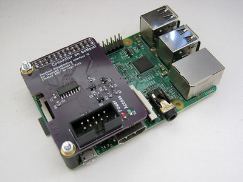

# tapecart mass programmer #

The tapecart mass programmer can be used to flash the firmware of a
newly-built tapecart and write data to its flash memory without
requiring a C64. It is implemented as an addon board for a Raspberry
Pi. Although in theory it should work with almost any version of the
Raspberry Pi, it has only been tested with a Raspberry Pi 2.

The finished programmer (without cable) looks like this:

## Hardware ##

The schematics and layout for the mass programmer are in the
[kicad](kicad) subdirectory. It includes a PDF version of the
schematic for easier previewing as well as pre-generated gerber files
suitable for fabrication. A BOM file in CSV format is included as
well.

To connect the programmer board to the tapecart, a cable with a 10-pin
2x5 connector on one end and an 8-pin 1.27mm pin header (pin 7
removed) on the other end is required. Since the pins on the 10-pin
connector and the 8-pin header are connected 1:1, the easiest way to
construct this is to use an IDC plug for the 10-pin side as the ribbon
cable has the same pin pitch as the 8-pin header on the other end. If
you do this, pin 7 on the cable will be unused as this pin must be
removed from the 8-pin header to ensure that it cannot be inserted the
wrong way. It is recommended to select a 1.27mm pin header with long
pins as they will have more flexibility, making better contact to the
plated vias on the tapecart's circuit board.

The mass programmer has two LEDs, a red and a green one. The red LED
indicates that the tapecart connected to the mass programmer is
currently powered. The green LED mirrors the state of the tapecart's
own LED, the programing software uses it to show that data is being
written.

The mass programmer-to-tapecart connection is designed to allow
hot-plugging - in fact, a tapecart must not be connected to it while
the Raspberry Pi boots as the GPIO pins may not be in the correct state.

## Software ##

To use the mass programmer, a Linux installation with a number of
additional software packages is needed on the Raspberry Pi - see the
section below for some notes how to install and configure a new
Raspbian system to meet these requirements.

The scripts used for controlling the mass programmer are in the
[scripts](scripts) subdirectory.

The most important script is ``prepare.sh``, which sets up the basic
configuration of the Raspberry's GPIO lines. It must be run again
every time the Raspberry Pi is booted and no tapecart must be
connected to the mass programmer before this script has been run!

The scripts ``poweron.sh`` and ``poweroff.sh`` turn the poer to the
tapecart on or off. If the power is on, the red LED on the mass
programmer board lights up. You must only connect or disconnect a
tapecart to the mass programmer while the red LED is off.

The script ``reset-to-uart.sh`` switches the tapecart into its remote
command mode, which is used to program it using the mass
programmer. It must be run before tcprog.rb can communicate with the
tapecart, but it can only work if the tapecart's microcontroller has
been programmed with its firmware using OpenOCD.

The program ``tcprog.rb`` is the main programming tool. It uses the
remote command mode to program the flash contents of the tapecart,
similar to the flashtool on the C64. Please use ``tcprog.rb --help``
to see a short summary of its command line options.

An example full-device programming script is included as
``massprog.sh``. It needs three arguments, the firmware binary, the
initial loader binary and a single-file PRG file which are written to
a tapecart. This process makes a just-assembled, blank tapecart ready
for use with a C64, but it can also be used to rewrite the data on an
already-programmed tapecart. Feel free to customize it as needed, for
example to leave out the firmware and loader programming steps is you
just want to rewrite the contents of a pre-programmed cart.

The firmware of the tapecart's microcontroller is programmed using a
sufficiently recent version of [OpenOCD](http://openocd.org). A
suitable ``openocd.conf`` can also be found in the [scripts](scripts)
subdirectory.

## Setting up Raspbian ##

Quick notes on setting up a Raspbian environment suitable for the mass
programmer, assuming that you know your way around a Linux command line:

* use [NOOBS](https://www.raspberrypi.org/downloads/noobs/) (or NOOBS
    Lite) to install a fresh copy of Raspbian (last tested using NOOBS
    version 2.0, but it should also work with later versions)
* disable the serial console by editing ``/boot/cmdline.txt``, remove
    the statement ``console=serial0,115200`` and reboot afterwards
* install a few required packages using ``sudo apt-get install
    libusb-1.0-0-dev libusb-dev gawk ruby-dev``
* install the serial port library for Ruby using ``gem install
    --user-install serialport``
* install a sufficiently-recent version of OpenOCD, meaning at least
    version 0.10.0 - the package in Raspbian is probably too old!

You can verify parts of the installation by running ``./tcprog.rb
--help`` - if it just shows the command line options, Ruby and the
required serialport library are working correctly.
